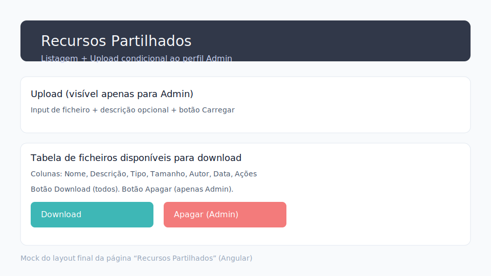

# US – Recursos Partilhados

Implementámos a área “Recursos Partilhados” pedida na US com stack ASP.NET Core + Angular, cumprindo autenticação via OIDC/cookies, autorização por policies, file system storage e auditoria.

## Localização e configuração

- **API**: todos os endpoints expostos em `/api/public-resources`.
- **Pasta no servidor**: configurável em `TodoApi/appsettings*.json` com a chave `SharedResources:Root`. Valor por omissão `storage/public` (criada automaticamente em `Program.cs`).
- **Angular**: página disponível em `/public-resources`, protegida pelo `AuthGuard` e menu lateral (item “Recursos Partilhados”).

```jsonc
"SharedResources": {
  "Root": "storage/public"
}
```

## Backend (.NET)

1. **Entidades EF Core**
   - `SharedResource`: Id, FileName, MimeType, Size, DiskPath, UploadedBy, UploadedAt, Description.
   - `ResourceAccessLog`: Id, ResourceId?, UserId, UserEmail, Action, IpAddress, UserAgent, OccurredAt.
2. **DbContext**
   - Novos `DbSet<SharedResource>` e `DbSet<ResourceAccessLog>` + helper `PortContext.AuditAsync(HttpContext, action, resourceId?)` que grava logs automaticamente.
3. **Autorização**
   - `PublicResources.Read`: `RequireAuthenticatedUser()` → listar/transferir.
   - `PublicResources.Write`: `RequireAuthenticatedUser().RequireRole("Admin")` → upload e delete (ver seed `Role.Name = "Admin"`).
4. **Controller `PublicResourcesController`**
   - `GET /api/public-resources` → lista recursos (todos os autenticados).
   - `GET /api/public-resources/{id}/download` → devolve ficheiro físico.
   - `POST /api/public-resources` → upload multipart (admin). `RequestSizeLimit(25 MB)`, sanitização `Path.GetFileName`, nomes únicos (`Guid`).
   - `DELETE /api/public-resources/{id}` → remove registo + ficheiro.
   - `GET /api/public-resources/audit` → últimos 100 registos de `ResourceAccessLog` (admin) para validar auditoria.

Cada ação invoca `AuditAsync` com ações `LIST`, `DOWNLOAD`, `UPLOAD`, `DELETE`, `LOGS`, garantindo rastreabilidade (quem, quando, IP, user-agent).

## Frontend (Angular)

- **Serviço `PublicResourcesService`**: usa `HttpClient` com `withCredentials`, tenta `/api` via proxy e faz fallback para `https://localhost:7167/api`. Expõe `list()`, `download(id)`, `upload(file, description)`, `remove(id)`.
- **Página `PublicResourcesComponent`**: tabela com nome, tipo, tamanho, autor e data; ação Download para todos os perfis autenticados; upload e delete apenas se `auth.isAdmin()`. Inclui formato amigável de tamanho/data e indicador de carregamento.
- **Interceptor/guard**: reusa `AuthGuard` existente para proteger a rota e garantir que apenas utilizadores com roles (`admin`, `operator`, `agent`, `authority`) navegam até à página; os cookies de sessão são enviados automaticamente por `HttpClient` (`withCredentials: true`).

## Auditoria

- Tabela `ResourceAccessLogs` regista sempre: `Action` (`LIST|DOWNLOAD|UPLOAD|DELETE|LOGS`), `ResourceId?`, `UserId`, `UserEmail`, `IpAddress`, `UserAgent`, `OccurredAt`.
- Endpoint `GET /api/public-resources/audit` (policy `PublicResources.Write`) permite aos admins verificar rapidamente se as operações foram registadas.

## Testes de aceitação

1. **Preparação**
   - Backend: `cd TodoApi && dotnet run`.
   - Frontend: `cd frontend && npm install && npm run dev -- --ssl` (ou usar proxy HTTPS).
2. **Utilizador normal (role != Admin)**
   - Autenticar via Google.
   - Navegar para `/public-resources`.
   - Esperado: consegue ver listagem e descarregar ficheiros (`Download`), mas os controlos de upload/delete não aparecem. `POST/DELETE` devolvem 403 (policy `PublicResources.Write`).
3. **Utilizador Admin**
   - Autenticar com conta associada ao role “Admin”.
   - Upload: escolher ficheiro + descrição opcional → botão “Carregar” grava em `storage/public` e mostra o novo registo no topo.
   - Delete: botão “Apagar” remove registo e ficheiro físico.
4. **Verificação de auditoria**
   - Executar `curl -k https://localhost:7167/api/public-resources/audit --cookie "..."` (estando autenticado via browser) ou usar ferramentas como Thunder Client com cookies.
   - Confirmar entradas para `LIST`, `DOWNLOAD`, `UPLOAD`, `DELETE` com timestamp, email e IP.

## Prints



## Notas de segurança/robustez

- Upload limitado a 25 MB (`RequestSizeLimit`) e `file.Length` também verificado no controller.
- Nome do ficheiro normalizado via `Path.GetFileName` e ficheiro físico guardado com `Guid` para evitar colisões/path traversal.
- Cookies `SameSite=None; Secure` e CORS permitem o Angular dev server HTTPS enviar credenciais.
- Falhas no upload apagam o ficheiro temporário; delete ignora IOExceptions mas regista aviso em log.
- Lista de logs restringida a Admin para evitar exposição de dados sensíveis.
